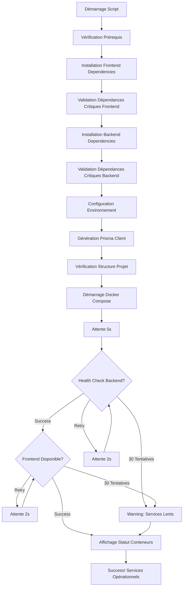

# Mise à Jour du Script d'Installation PowerShell

**Version: 1.1.0 - Wizard Edition**
**Date: 2025-11-01**

## 🎯 Vue d'Ensemble

Le script d'installation PowerShell (`install.ps1`) a été entièrement mis à jour pour intégrer les nouvelles fonctionnalités de l'Assistant Guidé Promptfoo et améliorer la robustesse de l'installation.

## ✨ Nouvelles Fonctionnalités

### 1. Validation des Dépendances Critiques

**Frontend:**
- ✅ `socket.io-client` - Communication WebSocket temps réel
- ✅ `react` - Framework UI
- ✅ `react-dom` - Rendu React
- ✅ `vite` - Build tool et dev server

**Backend:**
- ✅ `@nestjs/websockets` - Support WebSocket NestJS
- ✅ `socket.io` - Serveur WebSocket
- ✅ `@google/genai` - API Gemini AI
- ✅ `@nestjs/core` - Framework NestJS
- ✅ `@prisma/client` - Client ORM base de données

### 2. Vérification de la Structure du Projet

Le script vérifie automatiquement la présence de tous les fichiers critiques:

```
✓ Définitions TypeScript Promptfoo Wizard (types/promptfoo.ts)
✓ Service d'automation Promptfoo (services/promptfooAutomationService.ts)
✓ Interface Assistant Guidé (components/PromptfooWizard.tsx)
✓ Contrôleur principal avec health check (backend/.../app.controller.ts)
✓ Configuration Vite (vite.config.ts)
✓ Configuration Docker (docker-compose.yml)
```

### 3. Tests de Santé des Services (Mode Docker)

**Nouveauté**: Le script teste automatiquement la disponibilité des services après démarrage:

- **Backend Health Check**: `http://localhost:3003/api/v1/health`
  - Retry automatique (jusqu'à 30 tentatives)
  - Timeout intelligent de 2 secondes par tentative
  - Validation du code HTTP 200

- **Frontend**: `http://localhost:3004`
  - Vérification de la disponibilité
  - Attente du démarrage complet de Vite

- **Conteneurs Docker**:
  - Affichage du statut de chaque conteneur
  - Identification des services qui ne démarrent pas

### 4. Messages d'Installation Améliorés

**Mode Standalone:**
```powershell
🚀 Nouvelles fonctionnalités:
   • Assistant Guidé (Débutant) - Configuration Promptfoo en 3 étapes
   • Tests de sécurité automatisés avec validation
   • Protection contre les erreurs de configuration
```

**Mode Fullstack:**
```powershell
🚀 Nouvelles fonctionnalités:
   • Assistant Guidé avec backend WebSocket temps réel
   • Health checks et monitoring intégrés
   • API Gateway avec authentification JWT
```

**Mode Docker:**
```powershell
🚀 Nouvelles fonctionnalités:
   • Assistant Guidé (Débutant) - Configuration automatisée
   • Tests de sécurité avec dry-run et validation
   • WebSocket pour suivi temps réel des tests
   • Infrastructure complète (PostgreSQL, Redis, Monitoring)
```

### 5. URLs Complètes des Services (Mode Docker)

Le script affiche maintenant toutes les URLs importantes:

```
📍 URLs des services:
   Frontend:         http://localhost:3004
   API Gateway:      http://localhost:3003
   Health Check:     http://localhost:3003/api/v1/health
   API Docs:         http://localhost:3003/api/docs
   Adminer (DB UI):  http://localhost:8082
   Redis Commander:  http://localhost:8081
   Mailhog UI:       http://localhost:8025
   Grafana:          http://localhost:3002
   Prometheus:       http://localhost:9090
```

### 6. Commandes de Débogage Améliorées

```powershell
📝 Commandes utiles:
   Logs frontend:    docker-compose logs -f frontend
   Logs backend:     docker-compose logs -f api-gateway
   Tous les logs:    docker-compose logs -f
   Statut:           docker-compose ps
   Arrêter:          docker-compose down
   Redémarrer:       docker-compose restart
```

## 🔧 Fonctions Ajoutées

### `Verify-ProjectStructure()`
Vérifie la présence de tous les fichiers critiques du projet:
- Types TypeScript Promptfoo
- Services d'automation
- Composants React
- Contrôleurs backend
- Fichiers de configuration

**Retour**: `$true` si tous les fichiers sont présents, `$false` sinon

### `Test-DockerServices([int]$MaxAttempts, [int]$WaitSeconds)`
Teste la santé des services Docker après démarrage:
- **MaxAttempts**: Nombre maximum de tentatives (défaut: 30)
- **WaitSeconds**: Délai entre les tentatives (défaut: 2s)

**Actions**:
1. Attend 5 secondes initial pour le démarrage
2. Teste le health endpoint backend (retry jusqu'à 60s)
3. Teste la disponibilité du frontend (retry jusqu'à 60s)
4. Affiche le statut de tous les conteneurs Docker

**Retour**: `$true` si backend ET frontend sont sains, `$false` sinon

## 📋 Utilisation

### Installation Interactive

```powershell
.\install.ps1
```

Le script vous demandera de choisir le mode:
1. Standalone - Frontend uniquement
2. Fullstack - Frontend + Backend local
3. Docker - Tous les services (recommandé)

### Installation Directe avec Mode

```powershell
# Mode standalone
.\install.ps1 -Mode standalone

# Mode fullstack
.\install.ps1 -Mode fullstack

# Mode Docker (recommandé)
.\install.ps1 -Mode docker
```

### Options Avancées

```powershell
# Ignorer la vérification des prérequis (déconseillé)
.\install.ps1 -Mode docker -SkipDependencies
```

## 🎯 Améliorations par Rapport à la Version 1.0

| Fonctionnalité | v1.0 | v1.1 |
|---------------|------|------|
| Validation des dépendances critiques | ❌ | ✅ |
| Vérification de la structure du projet | ❌ | ✅ |
| Health checks automatiques | ❌ | ✅ |
| Tests de disponibilité des services | ❌ | ✅ |
| URLs complètes de tous les services | Partiel | ✅ |
| Commandes de débogage | Basique | Avancé |
| Messages d'aide contextuels | ❌ | ✅ |
| Support Assistant Guidé | ❌ | ✅ |
| Détection des erreurs de configuration | Limitée | Complète |

## 🚀 Workflow d'Installation Docker Amélioré



## 📝 Messages de Sortie

### ✅ Installation Réussie

```
╔════════════════════════════════════════════════╗
║        Installation terminée avec succès!      ║
╔════════════════════════════════════════════════╗

Mode d'installation: docker

================================================
  Vérification de la structure du projet
================================================

  ✓ Définitions TypeScript Promptfoo Wizard
  ✓ Service d'automation Promptfoo
  ✓ Interface Assistant Guidé (Débutant)
  ✓ Contrôleur principal avec health check
  ✓ Configuration Vite
  ✓ Configuration Docker

✓ Structure du projet validée!

================================================
  Vérification de la santé des services Docker
================================================

⏳ Attente du démarrage des services (jusqu'à 60s)...
✓ API Gateway: http://localhost:3003/api/v1/health - OK
✓ Frontend: http://localhost:3004 - OK

🐳 Statut des conteneurs Docker:
  ✓ frontend: running
  ✓ api-gateway: running
  ✓ postgres: running
  ✓ redis: running
  ✓ adminer: running
  ✓ redis-commander: running
  ✓ mailhog: running
  ✓ grafana: running
  ✓ prometheus: running
  ✓ test-execution-service: running

🎉 Tous les services sont opérationnels!
🚀 Accédez à l'application: http://localhost:3004
```

### ⚠️ Services Lents

```
⚠️  API Gateway ne répond pas au health check
⚠️  Frontend ne répond pas encore (peut nécessiter plus de temps)

⚠️  Certains services mettent du temps à démarrer
   Patientez 30-60 secondes puis vérifiez: http://localhost:3004
```

## 🔍 Dépannage

### Problème: Dépendances critiques manquantes

**Symptôme:**
```
  ✗ socket.io-client manquant
```

**Solution:**
```powershell
npm install
```

### Problème: Backend ne répond pas au health check

**Symptôme:**
```
⚠️  API Gateway ne répond pas au health check
```

**Solution:**
```powershell
# Vérifier les logs backend
docker-compose logs -f api-gateway

# Redémarrer le backend si nécessaire
docker-compose restart api-gateway

# Attendre 30-60 secondes et tester manuellement
curl http://localhost:3003/api/v1/health
```

### Problème: Fichiers du projet manquants

**Symptôme:**
```
  ✗ Fichier manquant: types/promptfoo.ts
```

**Solution:**
Vérifier que vous avez bien extrait/cloné tous les fichiers du projet. Certains fichiers peuvent être manquants si:
- Vous utilisez une version incomplète du repository
- Les fichiers ont été supprimés accidentellement
- Vous êtes dans le mauvais répertoire

## 📚 Documentation Associée

- **QUICK_START.md** - Guide de démarrage en 5 minutes
- **INSTALLATION.md** - Guide d'installation détaillé
- **SCRIPTS_README.md** - Documentation des scripts PowerShell
- **CLAUDE.md** - Architecture technique complète

## 🎉 Conclusion

Le script d'installation v1.1 offre:
- ✅ **Robustesse accrue** avec validation complète
- ✅ **Détection précoce des erreurs** avant démarrage
- ✅ **Health checks automatiques** pour confirmation de fonctionnement
- ✅ **Messages d'aide contextuels** pour guider l'utilisateur
- ✅ **Support complet** pour l'Assistant Guidé Promptfoo

**Recommandation**: Utilisez toujours le mode Docker (`.\install.ps1 -Mode docker`) pour une installation complète avec tous les services et tests de santé automatiques.
