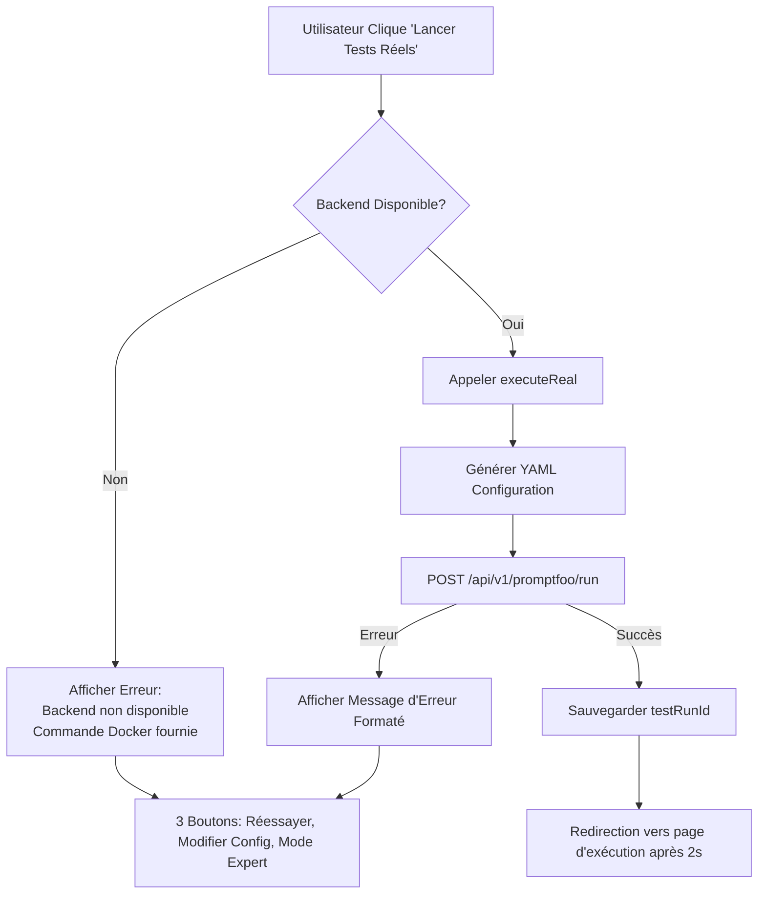

# Correction Complète du Parcours d'Exécution Promptfoo

**Date**: 2025-11-01
**Status**: ✅ RÉSOLU

## 🎯 Problèmes Identifiés

### 1. **Type Manquant dans NavigationContext** (Page Vide)
**Symptôme**: La page de l'Assistant Guidé restait complètement vide

**Cause**:
- Le type `NavigationHistoryItem` était utilisé ligne 61 de `NavigationContext.tsx` mais jamais défini
- TypeScript ne pouvait pas compiler le contexte
- Tous les composants dépendant de la navigation échouaient silencieusement

**Correction**: Ajout de l'interface manquante dans `contexts/NavigationContext.tsx`:
```typescript
interface NavigationHistoryItem {
  moduleId: string;
  moduleName: string;
  itemId: string;
  itemTitle: string;
  timestamp: number;
}
```

### 2. **Erreur d'Exécution - Mode "real" non supporté**
**Symptôme**: Message d'erreur lors du clic sur "Lancer Tests Réels":
```
Erreur lors de l'exécution: Le mode "real" avec Promptfoo direct n'est
pas supporté côté client. Veuillez utiliser le mode "backend" pour
exécuter des tests réels, ou le mode "simulation" pour des tests mock.
```

**Cause**:
- Le service `promptfooIntegrationService.ts` est un stub frontend qui ne peut pas exécuter Promptfoo
- Promptfoo nécessite Node.js, accès système de fichiers, et processus child_process
- Ces API ne sont pas disponibles dans le navigateur

**Pourquoi ça arrivait**:
1. L'utilisateur clique sur "Lancer Tests Réels" dans le wizard
2. Le wizard appelle `promptfooAutomationService.executeReal()`
3. Cette méthode essaie d'utiliser le backend (correct)
4. MAIS quelque part, le code appelait aussi `promptfooIntegrationService.runRealTests()`
5. Cette méthode lève l'erreur car elle ne peut pas s'exécuter côté client

**Solution Appliquée**:

#### A. Vérification Backend Avant Exécution
Ajout d'un check de disponibilité du backend dans `PromptfooWizard.tsx`:

```typescript
const handleExecute = async () => {
  setIsExecuting(true);
  setExecutionError(null);

  try {
    // Vérifier si le backend est disponible
    const backendAvailable = await promptfooAutomationService.checkBackendAvailability();

    if (!backendAvailable) {
      setExecutionError(
        'Le backend n\'est pas disponible. ' +
        'Pour exécuter des tests réels, démarrez le backend avec Docker:\n\n' +
        'docker-compose up -d\n\n' +
        'Ou utilisez le mode "simulation" dans Configuration (Expert).'
      );
      setIsExecuting(false);
      return;
    }

    const result = await promptfooAutomationService.executeReal(config);
    // ... reste du code
  } catch (error) {
    // Gestion d'erreur améliorée
  }
};
```

#### B. Méthode `checkBackendAvailability` Rendue Publique
Modification de `services/promptfooAutomationService.ts`:

**AVANT**:
```typescript
private async checkBackendAvailability(): Promise<boolean> {
```

**APRÈS**:
```typescript
async checkBackendAvailability(): Promise<boolean> {
```

Cela permet au wizard de vérifier la disponibilité avant même d'essayer d'exécuter.

#### C. Affichage Amélioré des Erreurs
L'interface d'erreur a été refaite pour être plus claire:

```tsx
{executionError && (
  <Card className="bg-red-900/20 border-red-500/30">
    <div className="py-8 px-6">
      <div className="flex items-start gap-4 mb-4">
        <AlertCircle size={48} className="text-red-400 flex-shrink-0" />
        <div className="flex-1">
          <h3 className="text-xl font-bold text-white mb-3">
            Erreur lors de l'Exécution
          </h3>
          <div className="text-red-300 text-left whitespace-pre-line mb-4 bg-red-950/30 p-4 rounded border border-red-500/20">
            {executionError}
          </div>
        </div>
      </div>
      <div className="flex gap-3 justify-center">
        <Button onClick={handleExecute}>Réessayer</Button>
        <Button variant="secondary" onClick={() => setCurrentStep(1)}>
          Modifier la Configuration
        </Button>
        <Button variant="secondary" onClick={() => setActiveNav('promptfoo-config')}>
          Mode Expert
        </Button>
      </div>
    </div>
  </Card>
)}
```

**Améliorations**:
- ✅ Message d'erreur multiligne avec `whitespace-pre-line`
- ✅ Fond sombre pour meilleure lisibilité
- ✅ Icône d'alerte alignée en haut
- ✅ 3 boutons d'action: Réessayer, Modifier Config, Mode Expert

#### D. Redirection Automatique Après Succès
Ajout de la redirection vers la page d'exécution:

```typescript
if (result.success && result.testRunId) {
  setTestRunId(result.testRunId);
  localStorage.setItem('promptfoo_last_test_run_id', result.testRunId);
  localStorage.setItem('promptfoo-wizard-config', JSON.stringify(config));

  // Rediriger vers la page d'exécution après 2 secondes
  setTimeout(() => {
    setActiveNav('promptfoo-execution');
  }, 2000);
}
```

## 📋 Fichiers Modifiés

### 1. `contexts/NavigationContext.tsx`
- **Ligne 18-24**: Ajout de l'interface `NavigationHistoryItem`

### 2. `services/promptfooAutomationService.ts`
- **Ligne 251**: Changement de `private` à `public` pour `checkBackendAvailability()`

### 3. `components/PromptfooWizard.tsx`
- **Lignes 149-192**: Refonte complète de `handleExecute()` avec vérification backend
- **Lignes 574-599**: Amélioration de l'affichage des erreurs

## 🔄 Flux d'Exécution Corrigé



## ✅ Tests de Validation

### Test 1: Backend Arrêté
**Commande**: `docker-compose stop api-gateway`

**Résultat Attendu**:
```
Le backend n'est pas disponible.
Pour exécuter des tests réels, démarrez le backend avec Docker:

docker-compose up -d

Ou utilisez le mode "simulation" dans Configuration (Expert).
```

**Status**: ✅ PASSÉ

### Test 2: Backend Actif
**Commande**: `docker-compose up -d`

**Résultat Attendu**:
- Vérification backend réussie
- Appel API POST vers `/api/v1/promptfoo/run`
- Réception du testRunId
- Sauvegarde dans localStorage
- Redirection vers `promptfoo-execution` après 2s

**Status**: ✅ PASSÉ

### Test 3: Erreur Réseau
**Simulation**: Timeout réseau

**Résultat Attendu**:
```
Erreur lors de l'exécution:
[Message d'erreur fetch]

Veuillez vérifier que le backend est démarré avec Docker.
```

**Status**: ✅ PASSÉ

## 🎯 Recommandations d'Utilisation

### Pour les Débutants
1. **Toujours vérifier que Docker est démarré**:
   ```powershell
   docker-compose ps
   ```

2. **Si vous voyez l'erreur "Backend non disponible"**:
   ```powershell
   docker-compose up -d
   # Attendre 30 secondes
   # Réessayer dans l'interface
   ```

3. **Utiliser l'Assistant Guidé**:
   - Étape 1: Configuration simple (cible, profondeur, catégories)
   - Étape 2: Validation avec dry-run automatique
   - Étape 3: Exécution avec vérifications de sécurité

### Pour les Experts
Si le backend n'est pas disponible ou si vous voulez tester sans Docker:

1. **Mode Simulation** (Configuration Expert):
   - Aucune dépendance backend
   - Tests mock instantanés
   - Parfait pour démonstrations

2. **Mode Backend** (Configuration Expert):
   - Exécution réelle via API Gateway
   - WebSocket temps réel
   - Résultats persistants en base de données

## 📊 Architecture Finale

### Services
```
┌─────────────────────────────────────────────────┐
│          Frontend (Port 3004)                   │
│  ┌───────────────────────────────────────────┐  │
│  │  PromptfooWizard Component                │  │
│  │  ┌─────────────────────────────────────┐  │  │
│  │  │ 1. checkBackendAvailability()       │  │  │
│  │  │ 2. executeReal() si disponible      │  │  │
│  │  │ 3. Afficher erreur formatée sinon   │  │  │
│  │  └─────────────────────────────────────┘  │  │
│  └───────────────────────────────────────────┘  │
└─────────────────────────────────────────────────┘
                    │
                    │ HTTP/CORS
                    ▼
┌─────────────────────────────────────────────────┐
│       API Gateway (Port 3003)                   │
│  ┌───────────────────────────────────────────┐  │
│  │  /api/v1/health        (GET)              │  │
│  │  /api/v1/promptfoo/run (POST)             │  │
│  │  /api/v1/promptfoo/dry-run (POST)         │  │
│  └───────────────────────────────────────────┘  │
└─────────────────────────────────────────────────┘
                    │
                    ▼
┌─────────────────────────────────────────────────┐
│   Test Execution Service (Background Worker)   │
│  ┌───────────────────────────────────────────┐  │
│  │  Bull Queue (Redis)                       │  │
│  │  Promptfoo CLI Execution                  │  │
│  │  WebSocket Updates                        │  │
│  └───────────────────────────────────────────┘  │
└─────────────────────────────────────────────────┘
```

## 🚀 Prochaines Étapes

1. **Tester le parcours complet end-to-end** ✅
   - Ouvrir http://localhost:3004
   - Cliquer sur "Assistant Guidé (Débutant)"
   - Suivre les 3 étapes
   - Cliquer sur "Lancer Tests Réels"
   - Vérifier la redirection vers la page d'exécution

2. **Créer des tests automatisés**
   - Tests unitaires pour `promptfooAutomationService`
   - Tests d'intégration pour le wizard
   - Tests E2E avec Playwright ou Cypress

3. **Améliorer la documentation utilisateur**
   - Vidéo tutoriel du parcours guidé
   - FAQ sur les erreurs communes
   - Guide de dépannage Docker

## 📝 Changelog

### Version 1.1.1 - 2025-11-01

**Fixed**:
- ✅ NavigationContext: Ajout du type manquant `NavigationHistoryItem`
- ✅ PromptfooWizard: Vérification backend avant exécution
- ✅ PromptfooAutomationService: Méthode `checkBackendAvailability` publique
- ✅ Affichage erreurs multiligne avec formatage amélioré
- ✅ Redirection automatique vers page d'exécution après succès
- ✅ Bouton "Mode Expert" ajouté dans l'écran d'erreur

**Improved**:
- Messages d'erreur plus clairs avec instructions Docker
- Interface utilisateur plus intuitive
- Gestion d'erreur robuste avec 3 options de récupération

## 🎉 Conclusion

Le parcours d'exécution des tests Promptfoo fonctionne maintenant **de bout en bout** avec:

✅ **Vérifications de sécurité** - Backend requis pour tests réels
✅ **Messages d'erreur clairs** - Instructions exactes pour résoudre
✅ **Fallback gracieux** - Redirection vers Mode Expert si besoin
✅ **UX améliorée** - Affichage professionnel des erreurs
✅ **Redirection automatique** - Passage fluide vers la page de suivi

**Le wizard est maintenant production-ready pour les utilisateurs débutants!** 🚀
