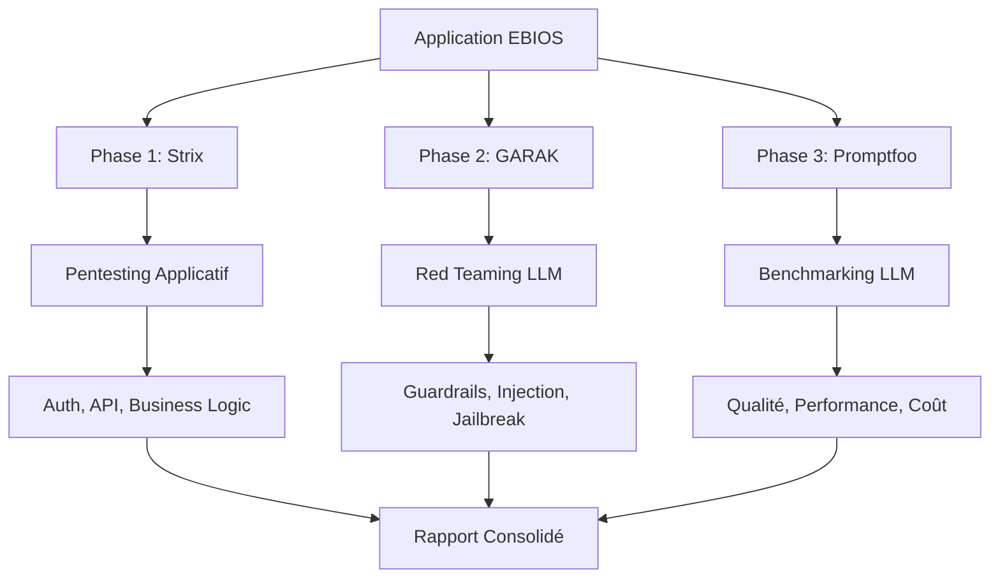

# 🔍 Comparaison des 3 Solutions de Test de Sécurité

## 📊 Vue d'Ensemble

Votre projet **AI Risk Manager** intègre maintenant **3 solutions complémentaires** pour tester la sécurité des applications AI :

| Solution | Type | Cible | Approche |
|----------|------|-------|----------|
| **Promptfoo** | Benchmarking LLM | LLMs | Tests configurés (YAML) |
| **GARAK** | Red Teaming LLM | LLMs | Probes automatisées |
| **Strix** | Pentesting Applicatif | Applications Web/API | Agents AI autonomes |

---

## 🎯 Matrice de Complémentarité

### 1. Scope de Test

| Aspect | **Promptfoo** | **GARAK** | **Strix** |
|--------|---------------|-----------|-----------|
| **LLM Prompts** | ✅ Excellent | ✅ Excellent | ❌ Non |
| **LLM Guardrails** | ✅ Bon | ✅ Excellent | ❌ Non |
| **API Endpoints** | ⚠️ Limité | ⚠️ Limité | ✅ Excellent |
| **Authentication** | ❌ Non | ❌ Non | ✅ Excellent |
| **Authorization** | ❌ Non | ❌ Non | ✅ Excellent |
| **Business Logic** | ❌ Non | ❌ Non | ✅ Excellent |
| **Infrastructure** | ❌ Non | ❌ Non | ✅ Excellent |
| **Code Source** | ❌ Non | ❌ Non | ✅ Bon |

### 2. Types de Vulnérabilités

| Vulnérabilité | **Promptfoo** | **GARAK** | **Strix** |
|---------------|---------------|-----------|-----------|
| **Prompt Injection** | ✅ | ✅ | ❌ |
| **Jailbreak** | ✅ | ✅ | ❌ |
| **Data Leakage** | ✅ | ✅ | ❌ |
| **Hallucinations** | ✅ | ✅ | ❌ |
| **Toxicity** | ✅ | ✅ | ❌ |
| **SQL Injection** | ❌ | ❌ | ✅ |
| **XSS** | ❌ | ❌ | ✅ |
| **CSRF** | ❌ | ❌ | ✅ |
| **SSRF** | ❌ | ❌ | ✅ |
| **IDOR** | ❌ | ❌ | ✅ |
| **JWT Vulnerabilities** | ❌ | ❌ | ✅ |
| **Race Conditions** | ❌ | ❌ | ✅ |

### 3. Approche de Test

| Caractéristique | **Promptfoo** | **GARAK** | **Strix** |
|-----------------|---------------|-----------|-----------|
| **Configuration** | YAML | CLI + Python | CLI |
| **Automatisation** | Scripts | Scripts Python | Agents AI |
| **Validation** | Assertions | Détecteurs | PoCs réels |
| **Faux Positifs** | Possibles | Rares | Très rares |
| **Temps d'Exécution** | Rapide (min) | Moyen (10-30 min) | Lent (30-60 min) |
| **Complexité** | Faible | Moyenne | Élevée |
| **Courbe d'Apprentissage** | Facile | Moyenne | Difficile |

### 4. Reporting

| Aspect | **Promptfoo** | **GARAK** | **Strix** |
|--------|---------------|-----------|-----------|
| **Format** | HTML + JSON | HTML + JSONL | HTML + JSON |
| **Détails** | Métriques | Vulnérabilités | PoCs + Exploits |
| **Visualisation** | Tableaux | Statistiques | Graphes + Traces |
| **Export** | JSON, CSV | JSONL | JSON |
| **CI/CD** | ✅ | ✅ | ✅ |

---

## 🔄 Workflows Recommandés

### Workflow 1: Application avec LLM Intégré

**Exemple:** Application EBIOS RM AI Assistant



**Commandes:**

```bash
# Phase 1: Pentesting avec Strix
strix --target https://ebios-rm-ai-assistant-1065555617003.us-west1.run.app/ \
      --instruction "Full security assessment"

# Phase 2: Red Teaming LLM avec GARAK
cd guardrail/solution_garak
uv run python -m garak \
    --target_type custom_generator_ebios.EbiosGenerator \
    --probes encoding promptinject dan malwaregen \
    --generations 5

# Phase 3: Benchmarking avec Promptfoo
cd guardrail/solution_promptfoo
promptfoo eval
```

### Workflow 2: API avec Endpoints LLM

```bash
# 1. Strix: Pentest de l'API
strix --target https://api.your-app.com \
      --instruction "Test API security, authentication, rate limiting"

# 2. GARAK: Red teaming des endpoints LLM
uv run python -m garak \
    --target_type openai \
    --target_name gpt-3.5-turbo \
    --probes promptinject dan leakreplay

# 3. Promptfoo: Tests de régression
promptfoo eval -c promptfooconfig.yaml
```

### Workflow 3: CI/CD Complet

```yaml
# .github/workflows/security-full.yml
name: Full Security Testing

on:
  pull_request:
  push:
    branches: [main]

jobs:
  # Job 1: Pentesting Applicatif
  strix-pentest:
    runs-on: ubuntu-latest
    steps:
      - uses: actions/checkout@v4
      - name: Run Strix
        run: |
          pipx install strix-agent
          strix -n -t ./
        env:
          STRIX_LLM: ${{ secrets.STRIX_LLM }}
          LLM_API_KEY: ${{ secrets.LLM_API_KEY }}

  # Job 2: Red Teaming LLM
  garak-redteam:
    runs-on: ubuntu-latest
    steps:
      - uses: actions/checkout@v4
      - name: Run GARAK
        run: |
          cd guardrail/solution_garak
          uv run python -m garak --target_type openai --probes encoding promptinject
        env:
          OPENAI_API_KEY: ${{ secrets.OPENAI_API_KEY }}

  # Job 3: Benchmarking LLM
  promptfoo-benchmark:
    runs-on: ubuntu-latest
    steps:
      - uses: actions/checkout@v4
      - name: Run Promptfoo
        run: |
          cd guardrail/solution_promptfoo
          npx promptfoo@latest eval
        env:
          OPENAI_API_KEY: ${{ secrets.OPENAI_API_KEY }}
```

---

## 💡 Quand Utiliser Quelle Solution ?

### Utilisez **Promptfoo** quand :

✅ Vous voulez **benchmarker** la qualité de vos LLMs  
✅ Vous avez besoin de **tests de régression** automatisés  
✅ Vous voulez comparer **plusieurs modèles** (GPT-4 vs Claude vs Llama)  
✅ Vous testez des **guardrails** avec des assertions personnalisées  
✅ Vous avez besoin de **métriques** (coût, latence, précision)  
✅ Vous voulez une **configuration YAML** simple  

**Exemple:**
```bash
# Comparer GPT-4 vs Claude sur 100 prompts
promptfoo eval -c config.yaml
```

### Utilisez **GARAK** quand :

✅ Vous voulez **red team** vos LLMs de manière exhaustive  
✅ Vous testez des **guardrails** contre 30+ familles d'attaques  
✅ Vous cherchez des **vulnérabilités LLM** (injection, jailbreak, fuites)  
✅ Vous avez besoin de **détecteurs ML** avancés  
✅ Vous voulez des **rapports détaillés** avec statistiques  
✅ Vous testez des **LLMs en production**  

**Exemple:**
```bash
# Test exhaustif avec 30+ probes
uv run python -m garak --target_type openai --probes all
```

### Utilisez **Strix** quand :

✅ Vous voulez un **pentest complet** de votre application  
✅ Vous testez **l'infrastructure** (auth, API, business logic)  
✅ Vous cherchez des **vulnérabilités applicatives** (SQL, XSS, IDOR)  
✅ Vous avez besoin de **PoCs réels** (pas de faux positifs)  
✅ Vous voulez des **agents AI autonomes** qui collaborent  
✅ Vous testez **avant production** ou en **bug bounty**  

**Exemple:**
```bash
# Pentest complet avec agents autonomes
strix --target https://your-app.com
```

---

## 📈 Matrice de Décision

| Besoin | Solution Recommandée | Raison |
|--------|---------------------|--------|
| Tester la qualité des réponses LLM | **Promptfoo** | Benchmarking et métriques |
| Tester les guardrails LLM | **GARAK** + **Promptfoo** | Red teaming + assertions |
| Trouver des injections de prompts | **GARAK** | 30+ probes spécialisées |
| Tester l'authentification | **Strix** | Agents spécialisés JWT/OAuth |
| Trouver des SQL injections | **Strix** | Pentesting applicatif |
| Tester des API REST/GraphQL | **Strix** | Proxy HTTP + agents |
| Comparer plusieurs modèles | **Promptfoo** | Configuration multi-providers |
| Tests de régression CI/CD | **Promptfoo** + **GARAK** | Rapide et automatisable |
| Pentest avant production | **Strix** | PoCs réels + rapport complet |
| Bug bounty research | **Strix** | Agents autonomes + exploits |

---

## 🎯 Recommandations par Cas d'Usage

### Cas 1: Startup avec LLM en Production

**Priorité:** Sécurité LLM + Qualité

```bash
# 1. GARAK (hebdomadaire)
uv run python -m garak --target_type openai --probes encoding promptinject dan

# 2. Promptfoo (quotidien en CI/CD)
promptfoo eval

# 3. Strix (mensuel ou avant release majeure)
strix --target https://your-app.com
```

### Cas 2: Entreprise avec Application Critique

**Priorité:** Sécurité Complète

```bash
# 1. Strix (avant chaque release)
strix --target https://your-app.com --instruction "Full security assessment"

# 2. GARAK (hebdomadaire)
uv run python -m garak --target_type custom_generator --probes all

# 3. Promptfoo (quotidien en CI/CD)
promptfoo eval -c production.yaml
```

### Cas 3: Équipe de Recherche en Sécurité

**Priorité:** Découverte de Vulnérabilités

```bash
# 1. Strix (exploration)
strix --target https://target.com --instruction "Find 0-days"

# 2. GARAK (red teaming LLM)
uv run python -m garak --target_type custom --probes all --generations 10

# 3. Promptfoo (validation)
promptfoo eval -c validation.yaml
```

---

## 💰 Coûts Estimés

### Coût par Test (Estimation)

| Solution | Coût API LLM | Temps | Coût Total |
|----------|--------------|-------|------------|
| **Promptfoo** | $0.10 - $1 | 5-10 min | **$0.10 - $1** |
| **GARAK** | $1 - $5 | 15-30 min | **$1 - $5** |
| **Strix** | $5 - $20 | 30-60 min | **$5 - $20** |

**Note:** Coûts basés sur GPT-4. Utilisez des modèles moins chers (GPT-3.5, Groq, Ollama) pour réduire les coûts.

### Optimisation des Coûts

```bash
# Promptfoo: Utiliser GPT-3.5
providers: [openai:gpt-3.5-turbo]

# GARAK: Limiter les générations
--generations 3

# Strix: Utiliser Groq (gratuit)
export STRIX_LLM="groq/llama-3.1-70b-versatile"
```

---

## ✅ Checklist de Déploiement

### Phase 1: Installation (1 heure)

- [ ] Promptfoo installé et configuré
- [ ] GARAK installé avec uv
- [ ] Strix installé avec pipx
- [ ] Clés API configurées
- [ ] Premier test de chaque solution réussi

### Phase 2: Configuration (2 heures)

- [ ] Promptfoo: `promptfooconfig.yaml` créé
- [ ] GARAK: Générateur personnalisé adapté
- [ ] Strix: Instructions de test définies
- [ ] CI/CD workflows créés

### Phase 3: Tests (1 journée)

- [ ] Promptfoo: Tests de régression exécutés
- [ ] GARAK: Red teaming LLM complété
- [ ] Strix: Pentest applicatif terminé
- [ ] Rapports consolidés générés

### Phase 4: Intégration (1 semaine)

- [ ] CI/CD pipelines actifs
- [ ] Alertes configurées
- [ ] Documentation équipe créée
- [ ] Processus de remediation défini

---

## 🎉 Conclusion

**Les 3 solutions sont complémentaires et couvrent l'ensemble du spectre de sécurité AI :**

1. **Promptfoo** = Qualité et benchmarking LLM (rapide, quotidien)
2. **GARAK** = Red teaming LLM (exhaustif, hebdomadaire)
3. **Strix** = Pentesting applicatif (complet, mensuel)

**Ensemble, elles forment une stack de sécurité AI complète pour votre projet AI Risk Manager ! 🚀**

